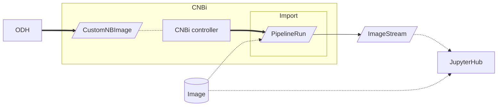
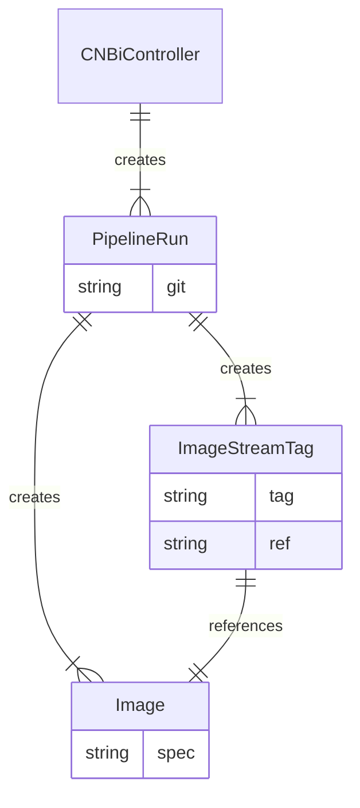
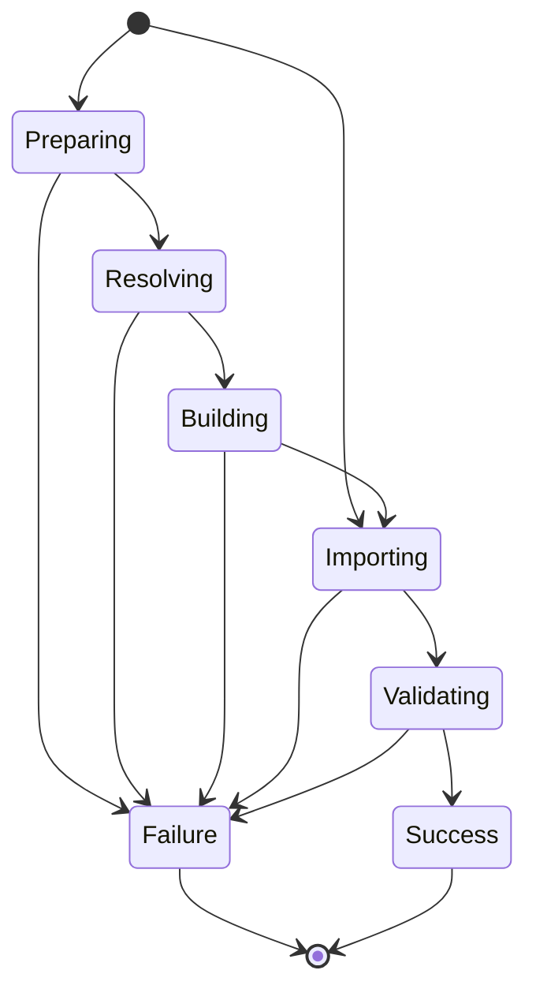

# the CNBi flow

[](https://hackmd.io/6BgU6fdSRvyMLZNPwGykfg)


## Proposal

We will introduce a new custom resource defintition (CRD) — called `CustomNBImage` — to be:

1. the interface between UI and service and
2. contain all the configuration items required for any CNBi use case.

A first draft of the [CNBi CRD](https://github.com/goern/meteor-operator/blob/8519622ce8af337531a7c9cab236513a432cd772/config/samples/meteor_v1alpha1_customnbimage.yaml) is available.

We will create a custom notebook image controller, that will reconcile the state of CNBi custom resource objects.

The ODH dashboard interfaces with the `CustomNBImage` CR:
 - for creating new custom notebooks
 - to get the state of currently building custom notebooks

### Import

The ODH dashboard creates a `CustomNBImage`. Note: the yellow box denotes the ownership (by Meteor's CNBi) of resources.



#### Example

This is a proposal for an import of an Image. It carries information according to [Open Data Hub annotations](https://github.com/opendatahub-io/jupyterhub-singleuser-profiles/blob/master/jupyterhub_singleuser_profiles/images.py#L10-L19) only `created-by` is interpreted in a different way. Annotations are passed to the PipelineRun.


```
apiVersion: meteor.zone/v1alpha1
kind: CustomNBImage
metadata:
  name: s2i-minimal-py38-notebook
  labels:
    app.kubernetes.io/created-by: cpe-_a-meteor.zone-CNBi-v0.1.0
  annotations:
    opendatahub.io/notebook-image-name: s2i-minimal-py38-notebook
    opendatahub.io/notebook-image-desc: minimal notebook image for python 3.8
    opendatahub.io/notebook-image-creator: goern
spec:
  buildType: ImageImport
  fromImage: quay.io/thoth-station/s2i-minimal-py38-notebook:v0.2.2
```

### Build

The PipelineRun created by the CNBi Controller will create a new container image and the corresponding ImageStreamTag (with all the annotations required by ODH).

```mermaid
flowchart TB
    O[ODH] ==> CR[/CustomNBImage/]
    subgraph CNBi Operator
        direction LR
        CR -.- C[CNBi controller] ==> PRprepare[/PipelineRun: prepare/]
        subgraph OpenShift Pipelines
            subgraph Sources
                S[(git)] & p[(package-list)]
            B[(base image)] & CR[(canonical rep = set of packages versions)] -.uses.-> PRprepare
            PRprepare --> PRbuild[/PipelineRun: build/]
            PRbuild --> PRvalidate[/PipelineRun: validate/]
        end
    end
    PRvalidate --> I[(Image)] & IS[/ImageStream/] -.-> JH[JupyterHub]
    O --Sources-.canonicalize.-> CR
```

> for cardinality notation of entity relationship diagram see https://vertabelo.com/blog/crow-s-foot-notation/



#### Example

This example shows how to build a notebook image using a specific runtime environment and a
list of packages.

```
apiVersion: meteor.zone/v1alpha1
kind: CustomNBImage
metadata:
  name: ubi8-py38-sample-3
[...]
spec:
  buildType: PackageList
  runtimeEnvironment:
    osName: ubi
    osVersion: "8"
    pythonVersion: "3.8"
  packageVersions:
    - pandas
    - boto3>=1.24.0
```


This next example shows how to declare a build based on an existing container image, updating or adding packages:


```
apiVersion: meteor.zone/v1alpha1
kind: CustomNBImage
metadata:
  name: ubi8-py38-sample-3
[...]
spec:
  buildType: PackageList
  builderImage: quay.io/thoth-station/s2i-minimal-py38-notebook:v0.2.2
  packageVersions:
    - pandas
    - boto3>=1.24.0
```


This example shows how to declare a build of a GitHub repository that contains notebooks:

```
apiVersion: meteor.zone/v1alpha1
kind: CustomNBImage
metadata:
  name: ubi8-py38-sample-3
[...]
spec:
  buildType: GitRepository
  repositoryUrl: https://github.com/AICoE/elyra-aidevsecops-tutorial
  gitRef: master
```


## CustomNBImage state diagram



### Import

Phase 1 BYON import state diagram from https://github.com/open-services-group/byon/issues/23#issuecomment-1055586737

```mermaid
    stateDiagram-v2
        [*] --> Importing
        Importing --> Validating
        Validating --> Success
        Validating --> Failure
        Success --> [*]
        Failure --> [*]

        note right of Importing
            Import pipeline is scheduled but
            ImageStream was not yet created
        end note

        note left of Validating
            Import pipeline is running,
            phase can be sourced from
            ImageStream annotation
        end note
  ```

## FAQ

> question: do we keep the git repo internall to the pipelinerun or do we push it to somewhere for later use? is the repo base-url a config of the controller? @codificat

If we want the possibility that the user can point to a git repo to request a build, then the git repo must be exposed at the CustomNBImage level.

Therefore, the git repo should be in the CNBi CR.

> Follow-up question: can it be, though, that for some use cases it is in the `spec` (e.g. "I want to build from that repo") while for others might only appear in the `status` (e.g. "FYI this is where your source of truth is being kept")?

> question: do we have multiple pipelinerun for prepare and build or just one? is 'prepare' specific to use case and 'build' agnostic? @FIkOzrY0QJa6x7Z2vsT1UQ @codificat

Let's confirm:
- *Prepare* involves getting the git repo up to date with the necessary information. This can involve e.g. updating `requirements.txt` (possibly with Thoth advice)

Some use cases, like *Import an image (AKA BYON)* do not need such git repo preparation.

In any case, I believe that by default the approach would be: (potentially) multiple Tasks, single Pipeline(Run).

One exception / potential reason to have multiple Pipeline(Run)s would be if the UX for a certain use case involves multiple steps where each step deserves a separate PR. In other words: if the git repo preparation has its own UX workflow, then it needs a dedicated Pipeline(Run).


## Things to discuss/review

We have different use cases that require different actions, and therefore different pipelines to be run. How to handle that?

Alternatives that come to mind are:
1. continue with a single `CustomNBImage` CRD, and have a field that determines the action (e.g. *import*, *build image*, *create image*...)
2. the same but without an explicit field; deduce the action (and therefore the pipeline) from the parameters that are defined. I don't quite like that - explicit better than implicit.
3. have multiple CRDs, e.g. one per action type, with specific fields (e.g. `CustomNBImageImport` points to an image to import, `CustomNBImageBuild` points to a repo..)

We are going for option 1: a single `CustomNBImage` resource with a `buildType` field that determines the actions to carry out.


## References

A demo of a similar `CustomNBImage` in action is available here: https://asciinema.org/a/517335

This section contains pointers to other components that are relevant to this effort.

### BYON import

The [BYON pipelines](https://github.com/open-services-group/byon/blob/3b23be51f6ea49507a03263bb2f9a48c3d8e6ed0/Makefile#L50-L67) expect the following parameters:

- url: points to the image in the registry
- name: to show in JH spawner (?)
- desc:
- creator:

#### Background: Import (the BYON way)

For the phase 1 *Bring your own notebook (BYON)* functionality, the ODH dashboard creates a `PipelineRun`.

```mermaid
flowchart LR
    subgraph BYON Import
        PR[/PipelineRun/]
    end
    O[ODH] ==> PR --> IS[/ImageStream/] -.-> JH[JupyterHub]
    I[(Image)] -.-> PR & JH
```

### Meteor build resource

Here is how a [Meteor custom resource](https://github.com/AICoE/meteor-operator/blob/34731bb723ba13d8d1bb214d4626bb02438af72e/config/samples/meteor_v1alpha1_meteor.yaml) looks like:

```yaml
apiVersion: meteor.zone/v1alpha1
kind: Meteor
metadata:
  name: demo
spec:
  url: https://github.com/aicoe-aiops/meteor-demo
  ref: main
  ttl: 5000
```
