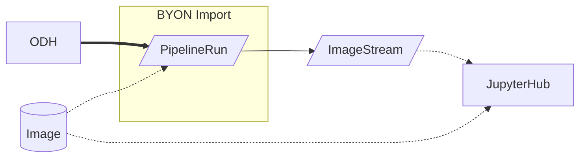
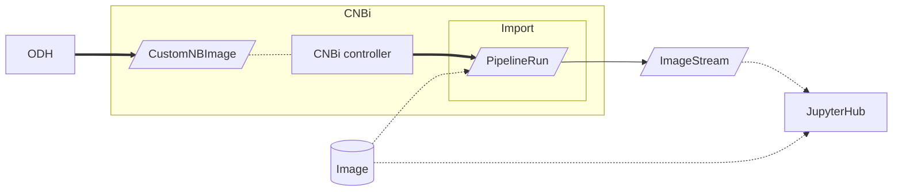
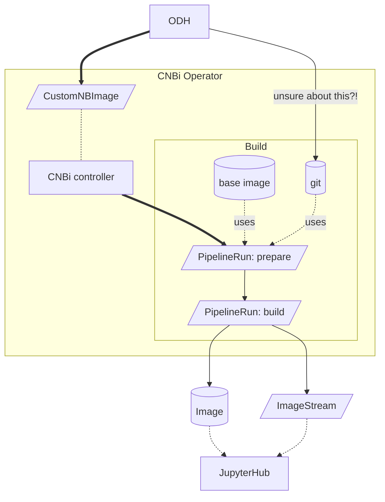
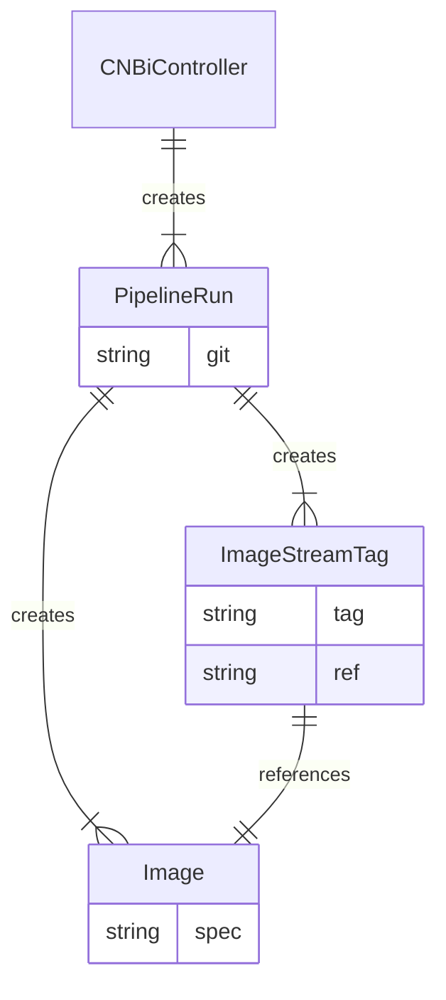
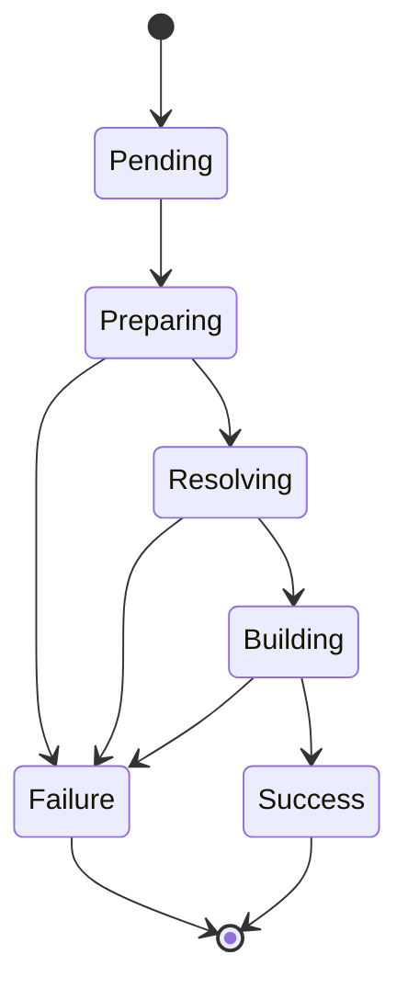

# the CNBi flow

### Background: Import (the BYON way)

For the phase 1 *Bring your own notebook (BYON)* functionality, the ODH dashboard creates a `PipelineRun`.



## Proposal

We will introduce a new custom resource defintition (CRD) — called `CustomNBImage` — to be:

1. the interface between UI and service and
2. contain all the configuration items required for any CNBi use case.

A first draft of the [CNBi CRD](https://github.com/goern/meteor-operator/blob/spike-cnbi-crd/api/v1alpha1/customnbimage_types.go#L38-L43) is available. @goern recorded [a demo](https://asciinema.org/a/516347) of [the first draft](https://github.com/goern/meteor-operator/tree/spike-cnbi-crd)

We will create a custom notebook image controller, that will reconcile the state of CNBi custom resource objects.

The ODH dashboard interfaces with the `CustomNBImage` CR:
 - for creating new custom notebooks
 - to get the state of currently building custom notebooks

### Import

The ODH dashboard creates a `CustomNBImage` instead of a `PipelineRun`.



### Build

The PipelineRun created by the CNBi Controller will create a new container image and the corresponding ImageStreamTag (with all the annotations required by ODH).



> for cardinality notation of entity relationship diagram see https://vertabelo.com/blog/crow-s-foot-notation/



## CustomNBImage state diagram

### Build



### Import

Phase 1 BYON import state diagram from https://github.com/open-services-group/byon/issues/23#issuecomment-1055586737

```mermaid
    stateDiagram-v2
        [*] --> Importing
        Importing --> Validating
        Validating --> Success
        Validating --> Failure
        Success --> [*]
        Failure --> [*]

        note right of Importing
            Import pipeline is scheduled but
            ImageStream was not yet created
        end note

        note left of Validating
            Import pipeline is running,
            phase can be sourced from
            ImageStream annotation
        end note
  ```

## FAQ

> question: do we keep the git repo internall to the pipelinerun or do we push it to somewhere for later use? is the repo base-url a config of the controller? @codificat

If we want the possibility that the user can point to a git repo to request a build, then the git repo must be exposed at the CustomNBImage level.

Therefore, the git repo should be in the CNBi CR.

> Follow-up question: can it be, though, that for some use cases it is in the `spec` (e.g. "I want to build from that repo") while for others might only appear in the `status` (e.g. "FYI this is where your source of truth is being kept")?

> question: do we have multiple pipelinerun for prepare and build or just one? is 'prepare' specific to use case and 'build' agnostic? @FIkOzrY0QJa6x7Z2vsT1UQ @codificat

Let's confirm:
- *Prepare* involves getting the git repo up to date with the necessary information. This can involve e.g. updating `requirements.txt` (possibly with Thoth advice)

Some use cases, like *Import an image (AKA BYON)* do not need such git repo preparation.

In any case, I believe that by default the approach would be: (potentially) multiple Tasks, single Pipeline(Run).

One exception / potential reason to have multiple Pipeline(Run)s would be if the UX for a certain use case involves multiple steps where each step deserves a separate PR. In other words: if the git repo preparation has its own UX workflow, then it needs a dedicated Pipeline(Run).

# CustomNBImage CRD

```
$ kubectl explain customnbimage.spec
KIND:     CustomNBImage
VERSION:  meteor.zone/v1alpha1

RESOURCE: spec <Object>

DESCRIPTION:
     CustomNBImageSpec defines the desired state of CustomNBImage

FIELDS:
   baseImage    <string>
     An existing image to validate/import, or to use as the base for builds

   creator    <string> -required-
     Creator is the name of the user who created the CustomNBImage

   description    <string>
     Description that should be shown in the UI

   displayName    <string> -required-
     Name that should be shown in the UI

   packageVersions    <[]string>
     PackageVersion is a set of Packages including their Version Specifiers

   pipelines    <[]string> -required-
     List of pipelines to initiate for this meteor

   ref    <string>
     Branch or tag or commit reference within the repository.

   repoURL    <string>
     Git repository containing source artifacts and build configuration

   runtimeEnvironment    <Object>
     RuntimeEnvironment is the runtime environment to use for the Custome
     Notebook Image

   ttl    <integer>
     Time to live after the resource was created.
```

## Sample `CustomNBImage` resources

### Build an image from a package list

```yaml
---
apiVersion: meteor.zone/v1alpha1
kind: CustomNBImage
metadata:
  name: ubi8-py38-sample-3
spec:
  displayName: UBI8 Python 3.8 with Pandas
  creator: meteor
  runtimeEnvironment:
    osName: ubi
    osVersion: "8"
    pythonVersion: "3.8"
  packageVersions:
    - pandas
    - boto3>=1.24.0
  pipelines:
    - prepare
```

#### (prievious draft version)

this was in a previous PoC / draft. Purpose of having it here is to compare with the current proposal above, it could be deleted and the proposal adjusted as appropriate:

```yaml
---
apiVersion: meteor.zone/v1alpha1
kind: CustomNBImage
metadata:
  name: ubi8-py38-pd
spec:
  action: build
  name: UBI8 Python 3.8 with Pandas
  creator: goern
  runtimeEnvironment:
    osName: ubi
    osVersion: "8"
    pythonVersion: "3.8"
  packageVersions:
    - pandas
    - boto3>=1.24.0
```

### Import an image (BYON-like)

```yaml
---
apiVersion: meteor.zone/v1alpha1
kind: CustomNBImage
metadata:
  name: osc-pytorch
spec:
  displayName: OS-Climate image with Pytorch
  description: This image is expected to PASS import validation
  creator: thoth-station
  baseImage: quay.io/os-climate/aicoe-osc-demo:latest
  pipelines:
    - import
```

A demo of a similar `CustomNBImage` in action is available here: https://asciinema.org/a/517335

## References

This section contains pointers to other components that are relevant to this effort.

### BYON import

The [BYON pipelines](https://github.com/open-services-group/byon/blob/3b23be51f6ea49507a03263bb2f9a48c3d8e6ed0/Makefile#L50-L67) expect the following parameters:

- url: points to the image in the registry
- name: to show in JH spawner (?)
- desc:
- creator:

### Meteor build resource

Here is how a [Meteor custom resource](https://github.com/AICoE/meteor-operator/blob/34731bb723ba13d8d1bb214d4626bb02438af72e/config/samples/meteor_v1alpha1_meteor.yaml) looks like:

```yaml
apiVersion: meteor.zone/v1alpha1
kind: Meteor
metadata:
  name: demo
spec:
  url: https://github.com/aicoe-aiops/meteor-demo
  ref: main
  ttl: 5000
```
