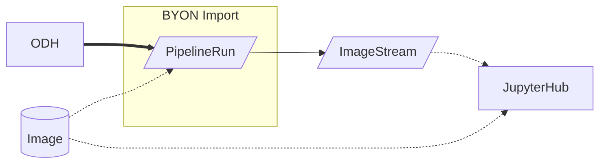
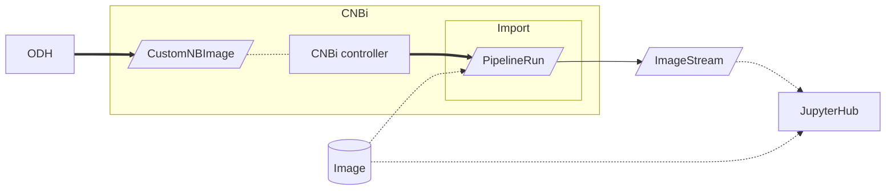
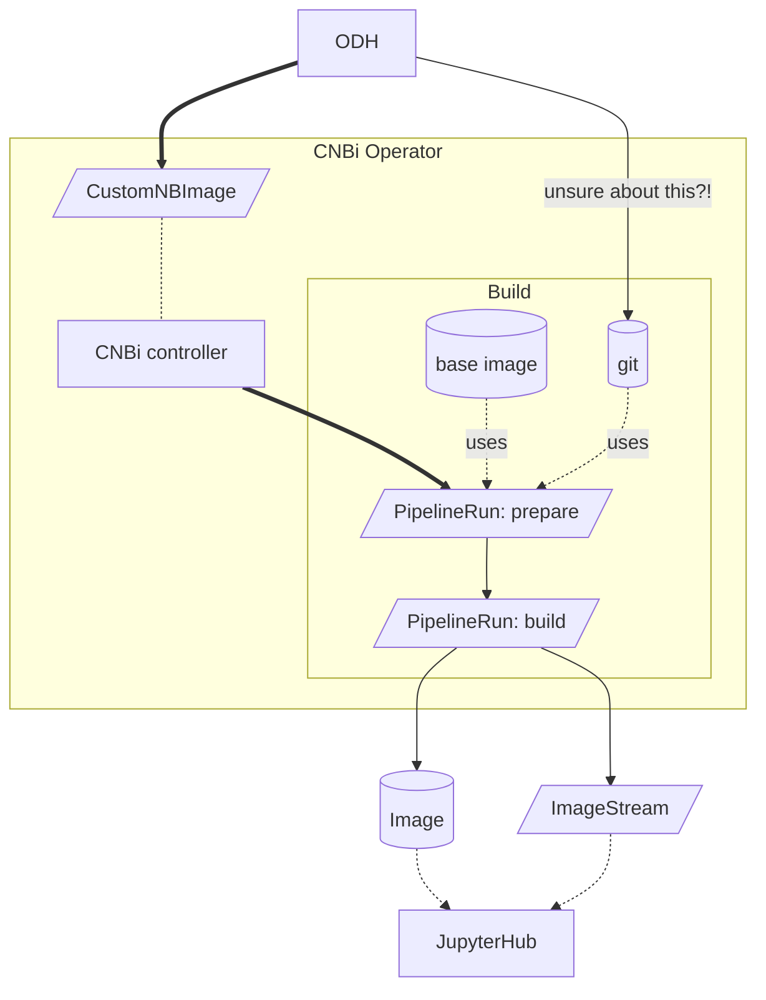
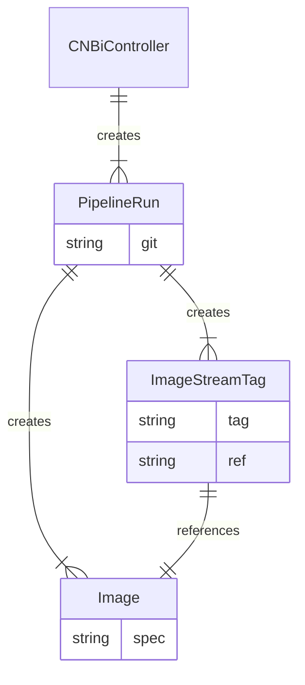
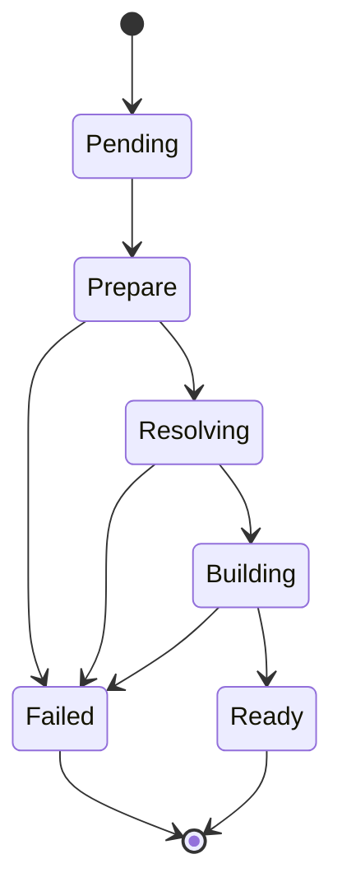

# the CNBi flow

### Import (the BYON way)

The ODH dashboard creates a `PipelineRun`.

### Import (proposed CNBi way)

Add an abstraction via a custom resource, `CustomNBImage`.

The ODH dashboard creates this CR instead of a `PipelineRun`.

### Proposal

We will interoduce a new custom resource defintition (CRD) — called `CustomNBImage` — to be:
 a) the interface between UI and service and 
 b) contain all the configuration items required for any CNBi use case.

A first draft of the [CNBi CRD](https://github.com/goern/meteor-operator/blob/spike-cnbi-crd/api/v1alpha1/customnbimage_types.go#L38-L43) is available. @goern recorded [a demo](https://asciinema.org/a/516347) of [the first draft](https://github.com/goern/meteor-operator/tree/spike-cnbi-crd)

We will create a custom notebook image controller, that will reconcile the state of CNBi custom resource objects.

> question: do we keep the git repo internall to the pipelinerun or do we push it to somewhere for later use? is the repo base-url a config of the controller? @codificat 

The ODH dashboard interfaces with the `CustomNBImage` CR:
 - for creating new custom notebooks
 - to get the state of currently building custom notebooks

> question: do we have multiple pipelinerun for prepare and build or just one? is 'prepare' specific to use case and 'build' agnostic? @FIkOzrY0QJa6x7Z2vsT1UQ @codificat 

The PipelineRun created by the CNBi Controller, will create a new container image, and the coresponding ImageStreamTag (with all the annotations required by ODH).

> for cardinality notation of entity relationship diagram see https://vertabelo.com/blog/crow-s-foot-notation/

## CustomNBImage state diagram

